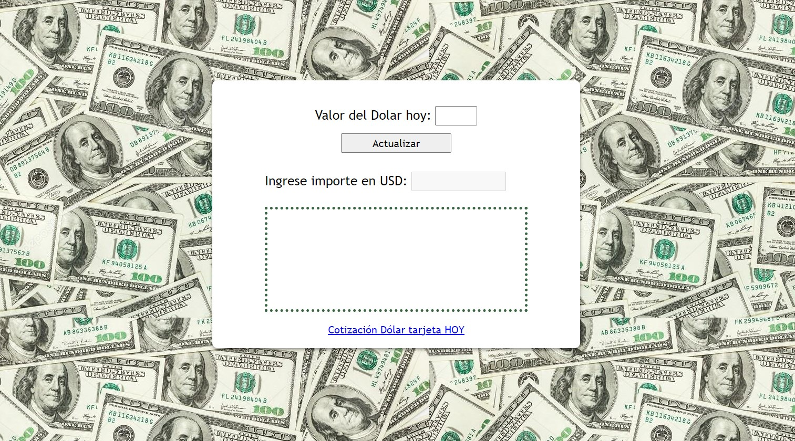

# Dollar_Currency_Converter
Convertidor de USD a Pesos Argentinos, pensado para calcular compras en el exterior, teniendo en cuenta impuestos aduaneros.

* Se deberá ingresar el valor del Dólar Tarjeta del día. (Podrá consultarlo mediante un enlace)
* Se calcula la conversion + impuestos por excedente de la franquicia de 50USD del Correo Argentino
* Se calcula además, el costo que cobra el correo al momento de pagar el "Costo de importación"

